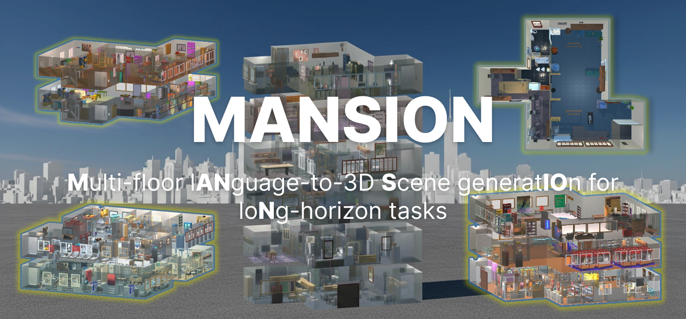

# MANSION

**MANSION: Multi-floor lANguage-to-3D Scene generatIOn for loNg-horizon tasks**

LLM-driven procedural multi-floor building generation. Given a natural-language description (e.g., *"2-story office building with conference rooms"*), Mansion generates complete building layouts including room segmentation, walls, doors, windows, furniture placement, lighting, and top-down rendered images.

> 🎉 **MANSION has been accepted to CVPR 2026!**

<div align="center">
  
</div>

<br>
<div align="center">
    <a href="https://arxiv.org/abs/2603.11554" target="_blank">
      </a>
    <a href="https://huggingface.co/datasets/superbigsaw/MansionWorld" target="_blank">
      </a>
    <a href="https://agibotgeneral.github.io/mansion-site/" target="_blank">
      </a>
</div>
<br>


## Installation

### 1. Create a virtual environment

```bash
conda create -n mansion python=3.10 -y
conda activate mansion
```

### 2. Install Python dependencies

```bash
cd mansion
pip install -r requirements.txt

# Install the required AI2-THOR version
pip install --extra-index-url https://ai2thor-pypi.allenai.org ai2thor==0+6f165fdaf3cf2d03728f931f39261d14a67414d0
```

### 3. Download scene assets (first run)

The project requires AI2-THOR and Objaverse-THOR model assets:

```bash
python -m objathor.dataset.download_holodeck_base_data --version 2023_09_23
python -m objathor.dataset.download_assets --version 2023_09_23
python -m objathor.dataset.download_annotations --version 2023_09_23
python -m objathor.dataset.download_features --version 2023_09_23
```

If the download is interrupted, you can manually download and extract the assets to `~/.objathor-assets/2023_09_23/`:

https://pub-daedd7738a984186a00f2ab264d06a07.r2.dev/2023_09_23/assets.tar

### 4. Install Mansion patch assets (required)

Download `mansion_patch.zip` from our HuggingFace repository:

> **https://huggingface.co/datasets/superbigsaw/MansionWorld**

Place the downloaded `mansion_patch.zip` in the project root directory (next to `setup_mansion.py`), then run:

```bash
python setup_mansion.py
```

This script will automatically extract the patch and install AI2-THOR local release, door database, annotations, and extra 3D assets to the correct locations.


## LLM Configuration

Before running the pipeline, configure your LLM API credentials. We support OpenAI-compatible APIs, Azure OpenAI, and custom model endpoints. See [`config/constants.py`](mansion/config/constants.py) for all available options.

```bash
# Example: OpenAI-compatible API
export OPENAI_API_KEY="your-api-key"
export OPENAI_API_BASE="https://api.openai.com"  # optional, for proxy/custom endpoints
```
Then specify `llm_provider` in `mansion_quickstart.py`:

```python
cfg = make_config(
    requirement="...",
    llm_provider="openai",   # "openai" | "azure" | "mixed"
)
```

- `"openai"` — All nodes use `OPENAI_CONFIG` from `config/constants.py`
- `"azure"` — All nodes use `AZURE_CONFIG` from `config/constants.py`
- `"mixed"` — Per-node LLM routing via `config/node_config.json`, supporting different models per pipeline stage


## Quick Start

```bash
python mansion_quickstart.py
```


## MansionWorld

**MansionWorld** is our dataset of 1,000 pre-generated multi-floor buildings. You can download it directly from HuggingFace without running the full MANSION generation pipeline:

> **https://huggingface.co/datasets/superbigsaw/MansionWorld**

## Mansion Gym

**Mansion Gym** (`mansion-api`) is a gymnasium-compatible environment built on top of MansionWorld, providing cross-floor embodied AI capabilities — navigation, object interaction, and long-horizon task execution across multiple floors.

### Installation

```bash
pip install mansion-api
```

### Quick Start

If you haven't set up the full MANSION pipeline yet, download the MansionWorld dataset from HuggingFace and open [`mansionworld_quickstart.ipynb`](mansionworld_quickstart.ipynb) to explore the key skills and interfaces provided by Mansion Gym.

For full API documentation, see the project page:

> **https://agibotgeneral.github.io/mansion-site/**


## Citation

If you find this work useful, please cite our paper:

```bibtex
@misc{che2026mansionmultifloorlanguageto3dscene,
      title={MANSION: Multi-floor lANguage-to-3D Scene generatIOn for loNg-horizon tasks},
      author={Lirong Che and Shuo Wen and Shan Huang and Chuang Wang and Yuzhe Yang and Gregory Dudek and Xueqian Wang and Jian Su},
      year={2026},
      eprint={2603.11554},
      archivePrefix={arXiv},
      primaryClass={cs.CV},
      url={https://arxiv.org/abs/2603.11554},
}
```


## Acknowledgements

This repository includes code adapted from [Holodeck](https://github.com/allenai/Holodeck) (allenai/Holodeck), licensed under Apache-2.0. We modified the original implementation for scene instantiation and object placement. See the LICENSE file and third-party notices for attribution details.

## License

This project is licensed under the Apache License 2.0. See [LICENSE](LICENSE) for details.
